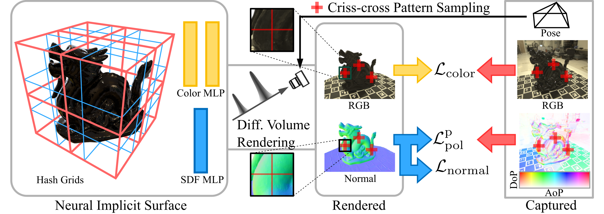

# 🍕PISR: Polarimetric Neural Implicit<br>Surface Reconstruction<br>for Textureless and Specular Objects
[[arxiv](https://arxiv.org/abs/2409.14331)]
[[dataset](https://drive.google.com/drive/folders/1ih4p91t8hYgPLFZ1hA9lF3rLN_6wHKfx?usp=drive_link)]

This is the reference implementation of the method described in
```
@inproceedings{gcchen2024pisr,
  title={PISR: Polarimetric Neural Implicit Surface Reconstruction for Textureless and Specular Objects},
  author={Guangcheng, Chen and Yicheng, He and Li, He and Hong, Zhang},
  booktitle={Proceedings of the European Conference on Computer Vision (ECCV)},
  year={2024},
}
```

# Overview
PISR takes as input posed RGB images, AoP maps and DoP maps, and outputs a neural implicit surface for an object.



# Setup
This implementation is based on [instant-nsr-pl](https://github.com/bennyguo/instant-nsr-pl).
The code has been tested on:
- Ubuntu 22.04, RTX3090, Driver Version: 535.183.01   CUDA Version: 12.2

To run PISR, please install the dependents following the [requirements of instant-nsr-pl](https://github.com/bennyguo/instant-nsr-pl?tab=readme-ov-file#requirements).

Here is the summary of the installation steps:
1. install pytorch and python packages:
```
git clone https://github.com/GCChen97/PISR
cd PISR

conda create -n pisr python=3.9
conda activate pisr
conda install pytorch==1.13.1 torchvision==0.14.1 torchaudio==0.13.1 pytorch-cuda=11.6 -c pytorch -c nvidia
conda install -c nvidia libcusolver-dev=11.3 # for compiling tinycudann

pip install pytorch-lightning==1.7.7 # require pip<24.1
pip install torchmetrics==0.11.4 torch_efficient_distloss pymcubes multiprocessing_on_dill omegaconf kornia opencv-python imageio matplotlib einops trimesh imageio[ffmpeg] imageio[pyav] tqdm

pip install https://nerfacc-bucket.s3.us-west-2.amazonaws.com/whl/torch-1.13.0_cu116/nerfacc-0.3.5%2Bpt113cu116-cp39-cp39-linux_x86_64.whl # install nerfacc 0.3.5
```
Note to use pytorch-lightning 1.7.7 and nerfacc 0.3.5 which are required by [instant-nsr-pl](https://github.com/bennyguo/instant-nsr-pl).

2. install [tiny-cuda-nn](https://github.com/NVlabs/tiny-cuda-nn?tab=readme-ov-file#pytorch-extension):
```
cd ..
git clone --recursive https://github.com/nvlabs/tiny-cuda-nn
cd tiny-cuda-nn/bindings/torch
python setup.py install
```


# Run
Before running PISR, please download the [dataset](https://drive.google.com/drive/folders/1ih4p91t8hYgPLFZ1hA9lF3rLN_6wHKfx?usp=drive_link) and uncompressed it following the file struture:
```
<object>
|--raw # raw 16bit images from the polarization camera
|--image # uint8 rgb images
|--aop # float32 one-channel images in [-pi/2, pi/2]
|--dop # float32 one-channel images in [0, 1]
|--mask (optional) # mask for foreground objects
|--intrinsics.npz
|--cameras_sphere.npz
|--gamma*.txt # gamma value when capturing the
```
Then run PISR in the terminal. We provide 2 ways to run PISR:
1. use launch.py
```
python launch.py --train --gpu 0  \
--config configs/pisr.yaml  
trial_name=test 
pol.train.lambda_pol="[2500, 0.0, 2.0, 5000]"
pol.train.size_kernel="[ [2500, 1, 15, 5000], [5000, 15, 1, 7500] ]"
pol.train.lambda_smooth="[ [2500, 0.0, 1.0, 5000], [5000, 1.0, 0.0, 7500] ]"
dataset.root_dir=<path>/<to>/<object>
dataset.has_mask=true
system.loss.lambda_mask="[ [0, 0.0, 0.01, 500], [500, 0.01, 0.0, 2500] ]"
export.export_mc_range=1.0
dataset.camera_distance=4
```
2. use launch_meta.py which contains some configs and commands for different experiments
```
python launch_meta.py
```

# Acknowlegdements
Thanks to the nice code of [instant-nsr-pl](https://github.com/bennyguo/instant-nsr-pl) by @[bennyguo](https://github.com/bennyguo).

# License
MIT License
